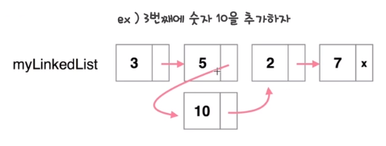
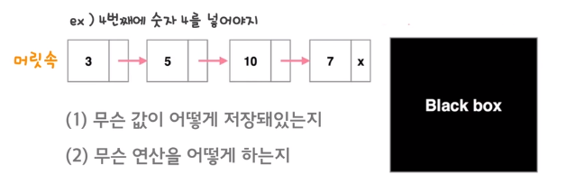
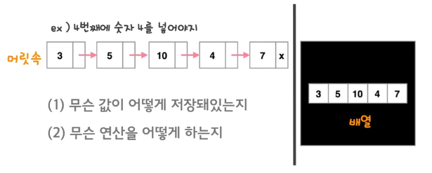
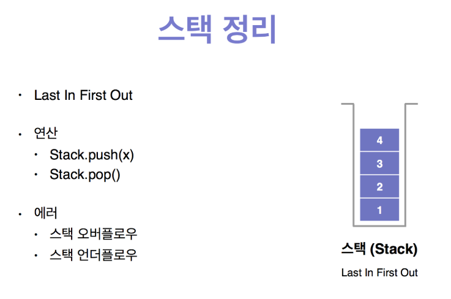

# L12


1. ### 기본 자료구조 (basic data-structure)

   

#### 컴퓨터공학의 기본 커리큘럼

1. 프로그래밍 언어

   ```
   C / C++
   Python
   Matlab
   ```

   1. 입력 / 출력
   2. 저장장치 (RAM)
   3. 연산장치 (CPU)

2. 자료구조 (Data structure) - 저장

   자료를 저장하는 구조

   특정 목적에 따라서 자료를 저장하는 방법이 달라질 수 있음

   ```
   Stack
   Queue
   Tree
   Graph
   ```

3. 알고리즘 - 연산 

   저장돼있는 자료들로 의미있는 결과 만드는 방법

   ```
   Brute-Force
   Divide & Conquer
   Dynamic Programming
   ```

   

#### 자료구조의 실생활 예제

[예제] 샴푸통 제작

##### 목적에 따라서 좋은 디자인과 나쁜 디자인이 있다

자료: 샴푸

자료구조: 샴푸통

```
장점 : 
샴푸를 담을 수 있다.
짜기가 편하다.

단점 :
쓸 때마다 뒤집어야 한다.
```

```
장점 :
조금 남아도 쉽게 짤 수 있다.

단점 :
쓰려면 많은 과정이 필요하다.
```

```
장점 :
사용이 편리하다.

단점 :
사용량이 많을 때 번거롭다.
```

```
장점 :
(우주에서) 사용이 편리하다.

단점 :
지구에서의 사용은 불편하다.
```

자료구조 : 

자료를 저장하기 위한 주머니

내 목적에 맞는 주머니를 어떻게 디자인 할 것인가?

목적을 성취하기 위한 자료구조를 디자인 하는 능력을 기르기 위해서


#### 기본 자료구조-변수, 배열

변수 (Variable) = 가장 기본적인 자료구조

```
x = 1
y = 'c'

print x
print y
```

배열 (Array) = 변수의 나열


장점 : i번째 원소를 바로 알 수 있다. (myList[i])

단점 : 원소의 추가 / 삭제가 까다롭다.


삭제도 뒤에 있는 애들을 다 땡겨오고 맨 뒤 공간을 없애야함


#### 기본 자료구조-링크드 리스트

링크드 리스크 (Linked List) = 여러개의 변수를 저장하는 다른 방법


ex) 3번째에 숫자 10을 추가하자




ex) 4번째에 숫자를 제거하자


장점 : 원소의 삽입/삭제가 빠르다.

단점 : i번째 원소를 알기가 쉽지 않다. 처음부터 따라가야함


#### 기본 자료구조 요약

* 배열 ( Array )
  * 장점 : i번째 원소를 바로 알 수 있다. (myList[i])
  * 단점 : 원소의 추가 / 삭제가 까다롭다.
* 링크드 리스트 ( Linked List )
  * 장점 : 원소의 추가 / 삭제가 간단하다.
  * 단점 : i번째 원소를 알기가 까다롭다.

우리 목적이 i번째 원소를 바로 알아야하므로 배열 많이 씀

컴퓨터 내부에서는 링크드 리스트 많이 쓰임


#### 캡슐화의 개념

캡슐화 : 자료구조(주머니) 구현의 핵심

int x;

int a[10];

캡슐화 (Encapsulation)

* 자료구조를 사용하는 사람은 자료구조가 어떻게 동작하는지 알 필요가 없다. 알아서도 안된다.





사용자 생각과 컴퓨터 내부에서 일어나는 일 다를 수 있다.


#### 스택이론




2. ### 자료구조

#### 구조체의 개념


#### 구조체의 구현


#### 최대값 기계1


#### 최대값 기계2


#### 구조체 용어 정리


#### 구조체를 쓰는 이유


#### 기초자료구조


3. ### 스택 (Stack)

#### 스택의 개념 LIFO


#### 스택오버플로우와 언더플로우


#### 스택정리


#### 스택구현하기1


#### 스택구현하기2


#### 스택구현하기*


#### 접시*


#### 괄호*


#### 괄호의 값*


#### 탑


#### 히스토그램에서 가장 큰 직사각형 찾기