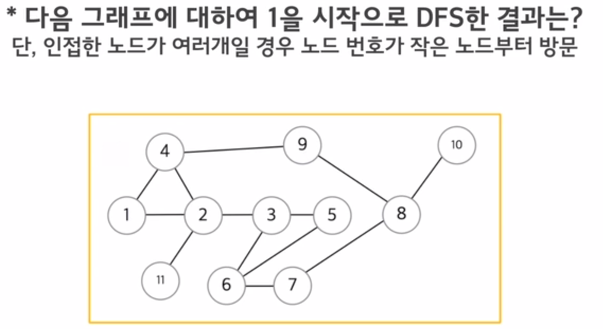
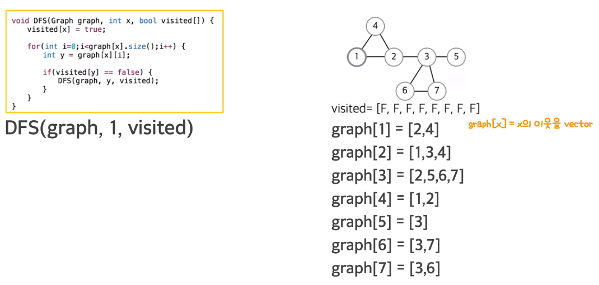

# L18

1. ## Graph

#### 그래프 소개

대표적인 자료구조

* 스택(Stack) : Last In First Out
* 큐(Queue) : First In First Out
* 트리(Tree)
* 그래프(Graph)

##### 그래프

* 정점(Node, vertex)과 간선(Edge)으로 이루어진 자료구조
* 차수(Degree) : 정점에 몇 개의 간선이 연결되어 있는가? ex) 노드2의 차수는 4
* 사이클(Cycle) : 자기 자신으로 다시 돌아올 수 있는 경로

##### 그래프는 왜 중요한가?

* 현실 세계의 많은 것들을 그래프로 나타낼 수 있다.

  즉, 그래프와 관련된 문제가 매우 많다.

* 그래프와 관련된 수학적 정리가 매우 많다.

  그래프 이론이라는 분야가 따로 있다 (Graph theory)

* (매우) 어렵다

  그래프와 관련된 이론도 어렵고 구현도 어렵다.


#### 그래프와 관련된 수학적 지식

* 간선의 개수는 정점의 제곱보다 작거나 같다.

  ### |E| <= |V|^2

  |E| 최댓값 = |V|^2 (정점 개수의 제곱) = 1+...+ |V|-1= |V|(|V|-1) / 2

  nC2 = n(n-1)/2 간선의 개수의 최댓값

* 각 정점의 차수의 합은 간선의 개수의 2배와 같다.

  차수의 합을 구할 때, 각 간선을 두 번씩 세기 때문


#### 인접 행렬

그래프의 구현: 인접행렬  /  인접 리스트

* 정점의 연결관계를 2차원 배열에 0, 1로 표현

  0: 연결이 안돼있음  //  1: 연결이 돼있음

Q1. x와 y가 연결이 돼있는가?

Q2. x와 연결된 정점이 모두 무엇인가?


#### 인접 행렬의 장점과 단점

Q1. x와 y가 연결이 돼있는가?

* 장점 : 연결 여부를 O(1)에 알 수 있다.

* 단점 : 인접한 정점을 찾는데 O(n)이 걸린다

  (실제 인접한 정점 수와 관계없이)

  무조건 n^2개의 칸을 써야한다

  (실제 간선의 개수와 관계없이)

  ex) 100개의 정점 / 200개의 간선의 경우 => 100x100=10000개의 칸 필요

  공간의 효율이 좋지 않음


#### 인접 행렬의 구현 1

```c
// 인접행렬을 이용한 그래프의 구현

#include <stdio.h>

const int MAX = 10;

// 5 6   (정점의 개수, 간선의 갯수)
// 1 2   1 --- 2
// 1 3   |\   /
// 1 4   | \ /
// 2 4   3  4 --- 5
// 4 5   ㄴ-------/
// 3 5

int main() {
  int n, m;  // n: 정점의 갯수, m: 간선의 갯수
  int myGraph[MAX][MAX] = {0,};
  
  scanf("%d %d", &n, &m);
  
  for(int i=0; i<m; i++) {
    int a, b;
    
    scanf("%d %d", &a, &b);  // a와 b가 연결이 되어 있다.
    
    myGraph[a][b] = 1;
    myGraph[b][a] = 1;
  }
  
  for(int i=1; i<=n; i++) {
    for(int j=1; j<=n; j++) {
      printf("%d ", myGraph[i][j]);
    }
    
    printf("\n");
  }
  
  return 0;
}
```


#### 인접 행렬의 구현 2


#### 인접 리스트


#### 인접 리스트의 장점과 단점


2. ## Library

#### 라이브러리(Library)


#### STL(Standard Template library)


#### Vector의 개념과 기초 예제


#### Vector의 구현 1


#### Vector의 초기화와 메소드


#### Vector의 구현 2


#### 인접 리스트의 구현


3. ## Graph traversal

#### 그래프 순회의 뜻


#### 그래프 순회의 종류 DFS & BFS


##  4. DFS

#### 깊이 우선 탐색의 철학

깊이우선탐색 (DFS)

* 깊이우선탐색 (Depth First Search)

  스택(일들 사이 선행관계 존재할 때, 발자취)을 이용하여 그래프를 순회하는 방법

  스택 = 선행관계

  나를 먼저 방문하고 그 다음으로 인접한 노드를 차례로 방문

  단, 방문했던 노드는 방문하지 않는다.


#### 깊이 우선 탐색의 예제

* 정점과 간선으로 이루어진 자료구조


#### 깊이 우선 탐색의 퀴즈



1 -> 2 -> 3 -> 5 -> 6 -> 7 -> 8 -> 9 -> 4 -> 10 -> 11


#### 깊이 우선 탐색의 전체적 구현

DFS (v, visited) :  // v: 시작점, visited: 방문한 노드 기록

1. v를 방문했다고 처리한다
2. v와 인접한 모든 w에 대하여 다음을 반복
3. 만약 w를 아직 방문하지 않았다면,(= 이웃을 아직 방문하지 않았다면)
4. DFS(w, visited)  // w : 이웃
5. 방문순서 반환

DFS 는 재귀를 이용

재귀함수 -> 스택 사용


#### 깊이 우선 탐색의 자세한 과정

```c
// graph 라는 그래프를 x 부터 시작해서 DFS 하라 (단, visited 는 방문 기록)
void DFS(Graph graph, int x, bool visited[]) {
    visited[x] = true;  // 방문했다 (false = 방문 아직 안했다)
    
    for(int i=0; i<graph[x].size(); i++) {
        int y = graph[x][i];
        
        if(visited[y] == false) {
            DFS(graph, y, visited);  // graph 라는 그래프를 y 부터 시작해서 DFS 하라
        }
    }
}
```



DFS(graph, 1, visited)  // visited = [F, T, F, F, F, F, F, F]  // i=0  y=2

DFS(graph, 2, visited)  // visited = [F, T, T, F, F, F, F, F]  // i=1  y=3  // 각각이 하던 일을 잠시 멈추고 기다리고 있는 상태  //  i=2  y=4  // DFS(graph, 1, visited) 로 돌아감

DFS(graph, 3, visited)  // visited = [F, T, T, T, F, F, F, F]  // i=1  y=5   -- DFS(graph, 5, visited) 끝나고 --> i=2  y=6  //  DFS(graph, 2, visited) 로 돌아감

DFS(graph, 5, visited)  // visited = [F, T, T, T, F, T, F, F]  // i=1    <- 이게 끝나면 DFS(graph, 3, visited) 로 돌아감

DFS(graph, 6, visited)  // visited = [F, T, T, T, F, T, T, F]  // i=1  y=7  // 할 일 다 하고 DFS(graph, 3, visited) 로 돌아감

DFS(graph, 7, visited)  // visited = [F, T, T, T, F, T, T, T]  // 할일 다 하고 DFS(graph, 6, visited) 로 돌아감

DFS(graph, 4, visited)  // visited = [F, T, T, T, T, T, T, T]  // 할 수 있는거 다 했으니 DFS(graph, 2, visited) 로 돌아감


1 -> 2 -> 3 -> 5 -> 6 -> 7 -> 4


#### 깊이 우선 탐색의 구현

```c
// 깊이우선탐색 (DFS)

//    1 ----- 2 ------- 6
//     \     / \       /
//      \   /   4 --- 5
//       \ /   / \
//        3 - 7 - 8 - 9

//  1 -> 2 -> 3 -> 7 -> 4 -> 5 -> 6 -> 8 -> 9

  // 9 12
  // 1 2
  // 1 3
  // 2 3
  // 2 4
  // 2 6
  // 3 7
  // 4 5
  // 4 7
  // 4 8
  // 5 6
  // 7 8
  // 8 9

#include <stdio.h>
#include <vector>

using namespace std;

const int MAX = 100;

// global variable

int n, m;
vector <int> myGraph[MAX];  // myGraph[x] = x의 인접 리스트
bool visited[MAX];

void DFS(int x) {
  // x 부터 시작해서 DFS 하여 그 순서를 출력하는 함수.
  // 단, visited에 방문 기록이 있음.
  
  visited[x] = true;
  printf("%d ", x);
  
  /*
    (1) ---- (2) --- (5) --- (6) -- (7)
     |\____ (3) __ (8) __ (9)
     \_____ (4) __ (10)
  
  */
  
  // myGraph[x] <- [1, 3, 4]
  
  for(int i=0; i<myGraph[x].size(); i++) {
    int y = myGraph[x][i];
    // x 와 y 가 연결이 되어 있다.
    
    if(visited[y] == false) {  // 너 방문 안했네
      DFS(y);  // 너 방문해 난 자고있을께 -> DFS(y) 가 일 다 끝나고 다시 돌아와서 깨보면 색칠상태 업데이트 되어있음
    }
  }
}

int main() {
  
  scanf("%d %d", &n, &m);
  
  for(int i=0; i<m; i++) {
    int a, b;
    
    scanf("%d %d", &a, &b);  // a--b
    
    myGraph[a].push_back(b);
    myGraph[b].push_back(a);
  }
  
  DFS(1);  // 1 부터 시작해서 DFS 한 결과를 출력
  
  printf("\n");
  
  return 0;
}
```


#### 깊이 우선 탐색의 정확성과 시간복잡도

DFS의 정확성 증면 / 시간복잡도

* 정확성 증명 - DFS 가 정말 순회를 하는가 (순회를 한다 : 정점을 모두 방문했다.)

  모든 정점을 방문한다.

  하나의 정점을 두번 이상 방문하지 않는다.

1. 나 방문
2. 모든 이웃에게 물어봄

`|V| = 2 * |E|`

* 시간복잡도

  각 정점은 1번씩, 각 간선은 2번씩 방문함

  O(V+E)


#### 깊이우선탐색과 너비우선탐색

```python
n, m = map(int, input().split())
g = [[] for _ in range(n)]  # 빈 2차원 리스트

for i in range(m):
  a, b = map(int, input().split())
  g[a].append(b)
  g[b].append(a)
  
for i in g:
  i.sort()


dfs_visited = [0] * n

def dfs(x):
  dfs_visited[x] = 1
  print(x, end=' ')
  
  for next_vertex in g[x]:
    if dfs_visited[next_vertex] == 0:
      dfs(next_vertex)


bfs_visited = [0] * n

def bfs(x):
  next_vertexes = []
  next_vertexes.append(x)
  while next_vertexes:  # next_vertexes 가 존재할 때
    next_vertex = next_vertexes.pop(0)  # next_vertexes 중 첫번째 값
    if bfs_visited[next_vertex]==0:  # 아직 방문하지 않았다면
      bfs_visited[next_vertex] = 1  # 방문처리
      print(next_vertex, end=' ')
      for v in g[next_vertex]:
        if not bfs_visited[v]:  # 연결된 정점들 중 방문하지 않은 정점들을
          next_vertexes.append(v)  # next_vertexes 에 추가
          

dfs(0)
print()
bfs(0)
```


#### 2색칠하기


#### 이분그래프판별


#### 웜바이러스


#### 단지번호붙이기

```python
n = int(input())

# zido = []
# for i in range(n):
#   temp = list(map(int, input()))
#   zido.append(temp)

zido = [list(map(int, input())) for i in range (n)]

dx = [-1, 0, 1, 0]
dy = [0, 1, 0, -1]
lst = []

def dfs(x, y):
  global count
  count += 1
  zido[x][y] = 0
  for i in range(4):
    X = x + dx[i]
    Y = y + dy[i]
    if X<0 or Y<0 or X>=n or Y>=n:
      continue
    if zido[X][Y] == 1:
      dfs(X, Y)

for i in range(n):
  for j in range(n):
    if zido[i][j] == 1:
      count = 0
      dfs(i, j)
      lst.append(count)

print(len(lst))
lst.sort()
for i in lst:
  print(i)
```


